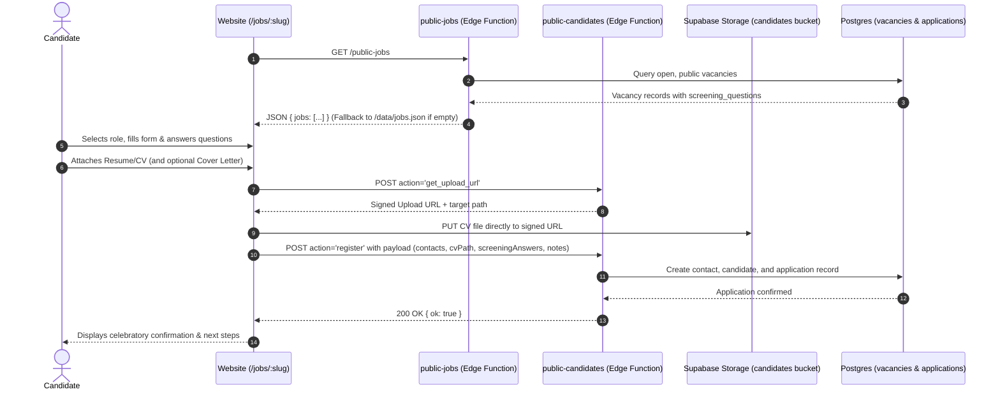

# JantaHR Public Website — Recruitment & Job Application System Documentation

> **Repository**: `/Users/jeffadhaya/Documents/Zcode/Review jantahr website`  
> **Last Updated**: 29 September 2026  
> **Status**: Production Ready  

---

## 1. System Overview

The public JantaHR website hosts the company's active career openings, executive search positions, and candidate application pipeline. It directly integrates with **JantaHR OPs** (the internal back-office ERP/CRM) via Supabase Edge Functions, while maintaining robust offline/fallback resilience using local JSON mock datasets.

---

## 2. Architecture & Data Flow

---

## 3. Key Components & Implementation Details

### 3.1 Routing & SEO
- **Route**: `/jobs/:slug` registered via lazy loading in [`src/App.tsx`](file:///Users/jeffadhaya/Documents/Zcode/Review%20jantahr%20website/src/App.tsx).
- **SEO Manager**: [`src/components/SeoManager.tsx`](file:///Users/jeffadhaya/Documents/Zcode/Review%20jantahr%20website/src/components/SeoManager.tsx) dynamically resolves `/jobs/[slug]` to update document titles and canonical links.

### 3.2 Job Listing Page (`src/pages/Jobs.tsx`)
- Displays all active client roles fetched via `jobsService.fetchJobs()`.
- Search by role title, summary, company, or keywords.
- Category filtering tabs (All, Finance & Accounting, Technology & Engineering, Human Resources, Sales & Commercial).
- Modern human phrasing: "Open Roles & Careers", "Job #ID", "Open Positions".
- Fallback Talent Pool submission CTA for candidates with specialized skills.

### 3.3 Job Detail Page (`src/pages/JobDetail.tsx`)
Redesigned from a dense sticky layout into a clean **single-column Greenhouse-style editorial dossier** (`max-w-4xl mx-auto`):
1. **Hero Banner**:
   - Breadcrumb navigation (`← All Open Roles / [Job Title]`).
   - Category pill, Job ID badge, title, and key metadata (Client, Location, Employment Type, Published Date).
   - Primary action: `"Apply for this Role ↓"` with smooth scroll to the application anchor.
   - Secondary action: `"Share this Role"` (copies URL to clipboard).
2. **Editorial Job Description Sections**:
   - **About the Role**: Natural, comprehensive narrative about the organization and the mission.
   - **What You’ll Do**: Bulleted list of day-to-day responsibilities and leadership mandate.
   - **What We Need**: Clear requirements, experience, competencies, and qualifications.
   - **What’s In It For You**: Salary structure cards, employment mode, review dates, and detailed benefits/perks list.
   - **Confidential Representation Charter**: Formal reassurance that candidate credentials are never shared without explicit consent.
3. **Seamless Anchored Application Section** (`#apply-form`):
   - Offset with `scroll-mt-28` to prevent fixed navbar occlusion.
   - **Standard Baseline Fields** (appears on every role by default):
     * First Name `*`
     * Last Name `*`
     * Email Address `*`
     * Telephone Number `*` (auto-formatted with `formatUgandanPhone`)
     * Location (City, Country) `*`
     * LinkedIn Profile `*`
     * Current Professional Role / Headline
     * Availability / Notice Period (Immediate, 2 Weeks, 1 Month, 2 Months, Exploring)
     * Expected Gross Salary (UGX)
     * Resume / CV `*` (drag & drop or file picker; supports PDF, DOC, DOCX up to 10 MB)
     * Cover Letter (dual-mode switcher: **Write Letter** in textarea OR **Upload Document** as separate file)
   - **Role-Specific Questions**:
     * Automatically rendered if the hiring manager in JantaHR OPs configured custom screening questions for the role.
     * Supports Numeric, Short Text, Yes/No radio groups, and Dropdown selects.
   - **Uganda Privacy Act Consent**: Explicit consent checkbox under the Data Protection and Privacy Act 2019.
   - **Celebratory Success State**: Confirmatory card detailing what happens next.
   - **Unconfigured Endpoint Fallback**: Pre-filled direct email client (`hello@jantahr.com`).

---

## 4. Service Layer & Utilities

| File | Purpose |
|:---|:---|
| [`src/types/jobs.ts`](file:///Users/jeffadhaya/Documents/Zcode/Review%20jantahr%20website/src/types/jobs.ts) | Defines `Job` interface and `ScreeningQuestion` schema (`id, question, type, required, options`). |
| [`src/services/jobsService.ts`](file:///Users/jeffadhaya/Documents/Zcode/Review%20jantahr%20website/src/services/jobsService.ts) | Fetches jobs from Supabase `public-jobs` or falls back to `/data/jobs.json`. Normalizes snake_case/camelCase, screening questions, responsibilities, and benefits. |
| [`src/services/applicationService.ts`](file:///Users/jeffadhaya/Documents/Zcode/Review%20jantahr%20website/src/services/applicationService.ts) | Manages 2-step direct CV upload to Supabase storage signed URLs and candidate registration payload dispatching. |
| [`src/lib/phone.ts`](file:///Users/jeffadhaya/Documents/Zcode/Review%20jantahr%20website/src/lib/phone.ts) | Formats and validates Ugandan telephone numbers (`+256` and local `07...` formats). |
| [`src/lib/constants.ts`](file:///Users/jeffadhaya/Documents/Zcode/Review%20jantahr%20website/src/lib/constants.ts) | Centralized endpoint URLs (`VITE_JOBS_ENDPOINT`, `VITE_CANDIDATE_ENDPOINT`). |

---

## 5. Codebase Hygiene & Maintenance

- **Dead Code Cleaned**: Removed obsolete `src/sections.backup/` directory (633 lines).
- **Public Assets Cleaned**: Removed internal `public/_mockup-preview.html` from production deployment.
- **Sitemap Fixed**: Removed non-existent `/careers` route, added `/pricing`, `/team`, and `/privacy`.
- **AI Training Fallback**: Fixed `AiTraining.tsx` to launch direct email client rather than silently faking registration success when endpoint is unconfigured.
- **Git Tracking**: Initialized clean git repository with `.gitignore`.
