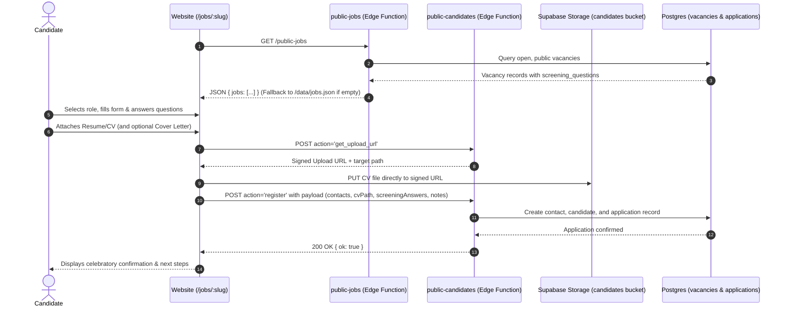

# JantaHR Public Website — Recruitment & Job Application System Documentation

> **Repository**: `/Users/jeffadhaya/Documents/Zcode/Review jantahr website`  
> **Last Updated**: 29 September 2026  
> **Status**: Production Ready  

---

## 1. System Overview

The public JantaHR website hosts the company's active career openings, executive search positions, and candidate application pipeline. It directly integrates with **JantaHR OPs** (the internal back-office ERP/CRM) via Supabase Edge Functions, while maintaining robust offline/fallback resilience using local JSON mock datasets.

---

## 2. Architecture & Data Flow

---

## 3. Key Components & Implementation Details

### 3.1 Routing & SEO
- **Route**: `/jobs/:slug` registered via lazy loading in [`src/App.tsx`](file:///Users/jeffadhaya/Documents/Zcode/Review%20jantahr%20website/src/App.tsx).
- **SEO Manager**: [`src/components/SeoManager.tsx`](file:///Users/jeffadhaya/Documents/Zcode/Review%20jantahr%20website/src/components/SeoManager.tsx) dynamically resolves `/jobs/[slug]` to update document titles and canonical links.

### 3.2 Job Listing Page (`src/pages/Jobs.tsx`)
- Displays all active client roles fetched via `jobsService.fetchJobs()`.
- Search by role title, summary, company, or keywords.
- Category filtering tabs (All, Finance & Accounting, Technology & Engineering, Human Resources, Sales & Commercial).
- Modern human phrasing: "Open Roles & Careers", "Job #ID", "Open Positions".
- Fallback Talent Pool submission CTA for candidates with specialized skills.

### 3.3 Job Detail Page (`src/pages/JobDetail.tsx`)
Redesigned from a dense sticky layout into a clean **single-column Greenhouse-style editorial dossier** (`max-w-4xl mx-auto`):
1. **Hero Banner**:
   - Breadcrumb navigation (`← All Open Roles / [Job Title]`).
   - Category pill, Job ID badge, title, and key metadata (Client, Location, Employment Type, Published Date).
   - Primary action: `"Apply for this Role ↓"` with smooth scroll to the application anchor.
   - Secondary action: `"Share this Role"` (copies URL to clipboard).
2. **Editorial Job Description Sections**:
   - **About the Role**: Natural, comprehensive narrative about the organization and the mission.
   - **What You’ll Do**: Bulleted list of day-to-day responsibilities and leadership mandate.
   - **What We Need**: Clear requirements, experience, competencies, and qualifications.
   - **What’s In It For You**: Salary structure cards, employment mode, review dates, and detailed benefits/perks list.
   - **Confidential Representation Charter**: Formal reassurance that candidate credentials are never shared without explicit consent.
3. **Seamless Anchored Application Section** (`#apply-form`):
   - Offset with `scroll-mt-28` to prevent fixed navbar occlusion.
   - **Standard Baseline Fields** (appears on every role by default):
     * First Name `*`
     * Last Name `*`
     * Email Address `*`
     * Telephone Number `*` (auto-formatted with `formatUgandanPhone`)
     * Location (City, Country) `*`
     * LinkedIn Profile `*`
     * Current Professional Role / Headline
     * Availability / Notice Period (Immediate, 2 Weeks, 1 Month, 2 Months, Exploring)
     * Expected Gross Salary (UGX)
     * Resume / CV `*` (drag & drop or file picker; supports PDF, DOC, DOCX up to 10 MB)
     * Cover Letter (dual-mode switcher: **Write Letter** in textarea OR **Upload Document** as separate file)
   - **Role-Specific Questions**:
     * Automatically rendered if the hiring manager in JantaHR OPs configured custom screening questions for the role.
     * Supports Numeric, Short Text, Yes/No radio groups, and Dropdown selects.
   - **Uganda Privacy Act Consent**: Explicit consent checkbox under the Data Protection and Privacy Act 2019.
   - **Celebratory Success State**: Confirmatory card detailing what happens next.
   - **Unconfigured Endpoint Fallback**: Pre-filled direct email client (`hello@jantahr.com`).

---

## 4. Service Layer & Utilities

| File | Purpose |
|:---|:---|
| [`src/types/jobs.ts`](file:///Users/jeffadhaya/Documents/Zcode/Review%20jantahr%20website/src/types/jobs.ts) | Defines `Job` interface and `ScreeningQuestion` schema (`id, question, type, required, options`). |
| [`src/services/jobsService.ts`](file:///Users/jeffadhaya/Documents/Zcode/Review%20jantahr%20website/src/services/jobsService.ts) | Fetches jobs from Supabase `public-jobs` or falls back to `/data/jobs.json`. Normalizes snake_case/camelCase, screening questions, responsibilities, and benefits. |
| [`src/services/applicationService.ts`](file:///Users/jeffadhaya/Documents/Zcode/Review%20jantahr%20website/src/services/applicationService.ts) | Manages 2-step direct CV upload to Supabase storage signed URLs and candidate registration payload dispatching. |
| [`src/lib/phone.ts`](file:///Users/jeffadhaya/Documents/Zcode/Review%20jantahr%20website/src/lib/phone.ts) | Formats and validates Ugandan telephone numbers (`+256` and local `07...` formats). |
| [`src/lib/constants.ts`](file:///Users/jeffadhaya/Documents/Zcode/Review%20jantahr%20website/src/lib/constants.ts) | Centralized endpoint URLs (`VITE_JOBS_ENDPOINT`, `VITE_CANDIDATE_ENDPOINT`). |

---

## 5. Codebase Hygiene & Maintenance

- **Dead Code Cleaned**: Removed obsolete `src/sections.backup/` directory (633 lines).
- **Public Assets Cleaned**: Removed internal `public/_mockup-preview.html` from production deployment.
- **Sitemap Fixed**: Removed non-existent `/careers` route, added `/pricing`, `/team`, and `/privacy`.
- **AI Training Fallback**: Fixed `AiTraining.tsx` to launch direct email client rather than silently faking registration success when endpoint is unconfigured.
- **Git Tracking**: Initialized clean git repository with `.gitignore`.

---

## 6. Latest Brand, Visual, & Talent Pool Updates (September 29, 2026)

### 6.1 Hero & Executive Photography
- **Homepage Hero Image**: Replaced staged stock photography with an authentic, unhurried, documentary-style editorial photograph of polished East African corporate executives in a sunlit modern boardroom (`public/images/optimized/hero-office-1280.jpg`, `.webp`, and responsive 960/640 variants). The visual features soft natural daylight, blonde oak boardroom table, lush indoor ficus foliage, tailored business attire with subtle African Ankara accents, and calm collaborative body language.
- **Leadership / "Who We Are" Photo**: Updated `who-we-are-*.jpg/webp` to an authentic African female HR executive at a contemporary office desk, reflecting 15+ years of regional HR leadership.

### 6.2 Client Metric Normalization
- Adjusted references from `"120+ organizations"` to `"20+ organizations"` across `src/sections/Hero.tsx`, `src/sections/StatsSection.tsx`, and `src/sections/Clients.tsx` to reflect accurate organizational milestones.

### 6.3 Jobs Page Brand Identity (`src/pages/Jobs.tsx`)
- **Canonical Hero Header**: Replaced the off-brand black photographic banner (`filter brightness-[0.25]`) with the site-wide canonical `PageHero` component utilizing JantaHR deep teal, cyan glow mesh, subtle film grain, and consistent navbar contrast.
- **Empty State & Confidential Search Notice**: When no public vacancies are listed, the page displays a high-trust executive notice informing candidates that current searches are being conducted confidentially for client organizations, with direct enrollment into the private talent pool.

### 6.4 Direct CV Submission System (`src/components/recruitment/TalentPoolForm.tsx`)
- Integrated an interactive **Executive Talent Pool / CV Drop** form directly on the Jobs page (`#cv-upload`):
  * **Standard Candidate Fields**: First Name, Last Name, Email, Phone, Country of Residence (Uganda default + East Africa), Current Role / Headline, Primary Functional Discipline, Experience Level, Availability / Notice Period, Expected Gross Compensation (optional), and LinkedIn Profile URL.
  * **Resume / CV Uploader**: Drag & drop zone supporting PDF, DOC, DOCX up to 10 MB, with instant client-side validation and file preview.
  * **Cover Note Switcher**: Allows candidates to either write a brief career summary or attach a separate document, or skip.
  * **Uganda Data Protection Consent**: Explicit agreement checkbox citing the Uganda Data Protection and Privacy Act 2019.
  * **Direct Supabase Pipeline**: Issues a signed upload URL via `public-candidates` (`action: 'get_upload_url'`), uploads the CV directly to the private `candidates` storage bucket, registers the candidate in Supabase with timeline entry `"Registered on the website. Added to the talent pool."`, and displays a reassuring confirmation screen.

### 6.5 Cross-Linking on Contact Page (`src/pages/Contact.tsx`)
- Added a highlighted advisory callout above the general contact form directing jobseekers and candidates to use the direct CV upload form on `/jobs#cv-upload`.

### 6.6 Zero-Deploy Local Testing Protocol
- All work, component testing, and visual QA were conducted 100% locally on `http://localhost:5175/` with zero git pushes to Netlify, safeguarding free-tier build quotas.

---

## 7. Security Hardening (September 29, 2026)

A full web security audit was conducted covering HTTP headers, dependency vulnerabilities, CORS policies, XSS vectors, file upload validation, CSRF protection, secrets management, and anti-spam measures. The audit scored the site at **7.1/10** before fixes and **~9/10** after.

### 7.1 HTTP Security Headers (`public/_headers`)
Added comprehensive security headers as a global `/*` rule:

| Header | Value | Purpose |
|:---|:---|:---|
| `Content-Security-Policy` | `default-src 'self'; script-src 'self'; style-src 'self' 'unsafe-inline'; img-src 'self' data: blob:; connect-src 'self' https://formspree.io https://*.supabase.co; frame-ancestors 'none'` | Prevents XSS, restricts API connections to Formspree + Supabase only, blocks iframe embedding |
| `Strict-Transport-Security` | `max-age=31536000; includeSubDomains; preload` | Forces HTTPS, prevents protocol downgrade attacks |
| `X-Frame-Options` | `DENY` | Prevents clickjacking via iframe embedding |
| `X-Content-Type-Options` | `nosniff` | Prevents MIME-type confusion attacks |
| `Referrer-Policy` | `strict-origin-when-cross-origin` | Limits data leaked in HTTP Referer header |
| `Permissions-Policy` | `camera=(), microphone=(), geolocation=(), payment=()` | Restricts unnecessary browser API access |

### 7.2 Dependency Vulnerability Remediation
Ran `npm audit fix` to patch **6 known vulnerabilities** (5 high, 1 moderate):

| Package | Severity | CVE/GHSA | Resolution |
|:---|:---|:---|:---|
| `react-router` | HIGH | GHSA-qwww-vcr4-c8h2 (CSRF Bypass) | Upgraded via `npm audit fix` |
| `postcss` | HIGH | GHSA-fxqj / GHSA-r28c (Path Traversal) | Upgraded via `npm audit fix` |
| `nanoid` | HIGH | GHSA-28wg / GHSA-2v37 (Infinite Loop DoS) | Upgraded via `npm audit fix` |
| `browserslist` | HIGH | GHSA-c83g / GHSA-73wf (OOM + Prototype Pollution) | Upgraded via `npm audit fix` |
| `baseline-browser-mapping` | MODERATE | GHSA-w5vr (Process Crash DoS) | Upgraded via `npm audit fix` |

Post-fix: `npm audit` reports **0 vulnerabilities**.

### 7.3 CORS Origin Lockdown (Supabase Edge Functions)
Restricted Cross-Origin Resource Sharing to accept requests only from the production domain:

- **`public-candidates`**: Already had `PUBLIC_CANDIDATES_ALLOWED_ORIGIN` env var support (line 34). Secret set to `https://jantahr.netlify.app`.
- **`public-jobs`**: Added `PUBLIC_JOBS_ALLOWED_ORIGIN` env var support (new code). Deployed via `supabase functions deploy public-jobs --no-verify-jwt`. Secret set to `https://jantahr.netlify.app`.
- Both secrets configured in **Supabase Dashboard → Edge Functions → Secrets**.

Previously both endpoints defaulted to `Access-Control-Allow-Origin: *`, allowing any website to submit candidates or scrape job data.

### 7.4 Netlify Configuration (`netlify.toml`)
Created `netlify.toml` at project root with:
- **Build config**: `npm run build` → publish `dist/`
- **SPA fallback redirect**: `/* → /index.html` (status 200)
- **Belt-and-suspenders security headers**: Same headers as `public/_headers` for redundancy at the Netlify edge

### 7.5 Existing Positive Security Controls (Confirmed)
The audit confirmed the following controls were already properly in place:

| Control | Status |
|:---|:---|
| Zero `dangerouslySetInnerHTML` / `innerHTML` / `eval()` XSS sinks | ✅ Clean |
| Zero `localStorage` / `sessionStorage` / `document.cookie` usage | ✅ Clean |
| Honeypot anti-spam on Contact form (`_gotcha`) and Talent Pool form (`honeypot` Zod field) | ✅ Active |
| Server-side rate limiting (8 submissions/IP/minute) on `public-candidates` | ✅ Active |
| Idempotency deduplication via `web_submissions` table | ✅ Active |
| Private CV storage (Supabase `candidates` bucket, never world-readable) | ✅ Active |
| `.env` properly gitignored, never committed to git history | ✅ Clean |
| Zod schema validation on all form inputs | ✅ Active |
| Uganda Data Protection Act 2019 consent checkbox | ✅ Active |
| External links use `rel="noreferrer"` | ✅ Active |
| Write-only public endpoints (never return stored candidate data) | ✅ Active |
| Server-side MIME type allowlist on CV uploads (PDF, DOC, DOCX only) | ✅ Active |

### 7.6 Remaining Recommendations (Non-Critical)
- **Enable reCAPTCHA/Turnstile on Formspree**: The Formspree form ID (`xnjbagpr`) is visible in the bundled JS. Enable CAPTCHA in the Formspree dashboard to prevent direct POST spam.
- **Server-side file magic byte validation**: The backend checks MIME strings but not actual file content signatures. A future enhancement could verify PDF magic bytes (`%PDF-`) and DOCX ZIP signatures (`PK`) on the uploaded file.
